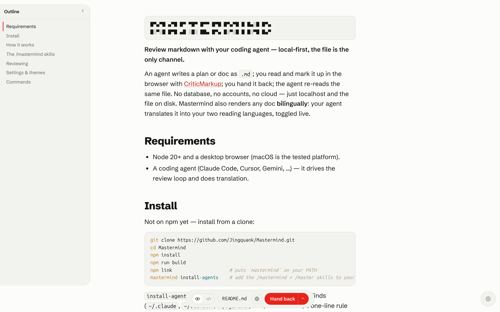
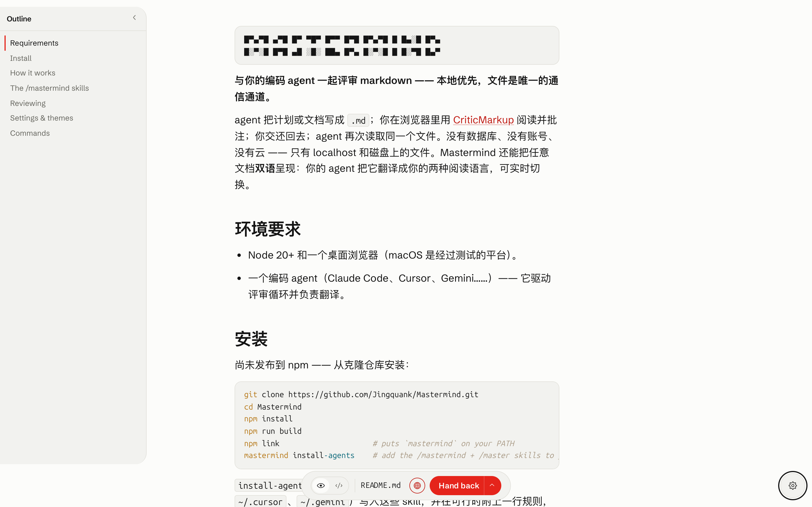
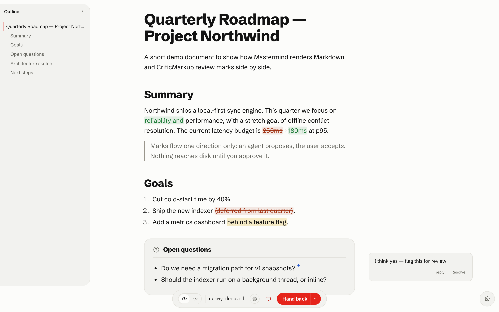
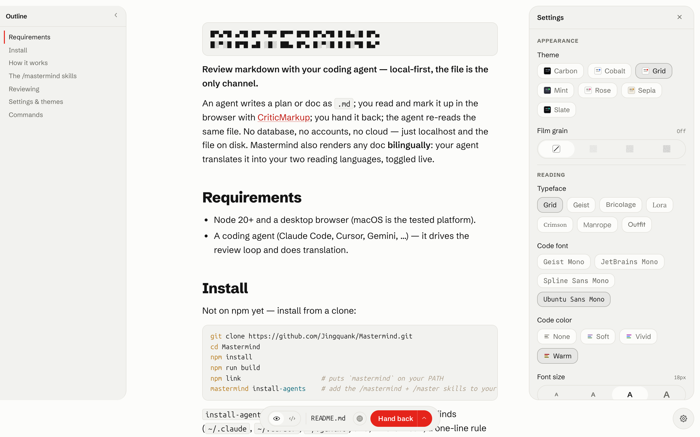

```
█▀▄▀█ ▄▀█ █▀ ▀█▀ █▀▀ █▀█ █▀▄▀█ █ █▄░█ █▀▄
█░▀░█ █▀█ ▄█ ░█░ ██▄ █▀▄ █░▀░█ █ █░▀█ █▄▀
```

**Review markdown with your coding agent — local-first, the file is the only channel.**

An agent writes a plan or doc as `.md`; you read and mark it up in the browser with
[CriticMarkup](https://github.com/CriticMarkup/CriticMarkup-toolkit); you hand it back; the agent
re-reads the same file. No database, no accounts, no cloud — just localhost and the file on disk.
Mastermind also renders any doc **bilingually**: your agent translates it into your two reading
languages, toggled live.



*The Reading view — rendered Markdown with the heading outline on the left.*

## Requirements

- Node 20+ and a desktop browser (macOS is the tested platform).
- A coding agent (Claude Code, Cursor, Gemini, …) — it drives the review loop and does translation.

## Install

Not on npm yet — install from a clone:

```sh
git clone https://github.com/Jingquank/Mastermind.git
cd Mastermind
npm install
npm run build
npm link                     # puts `mastermind` on your PATH
mastermind install-agents    # add the /mastermind + /master skills to your agent(s)
```

`install-agents` writes the skills for every coding agent it finds (`~/.claude`, `~/.cursor`,
`~/.gemini`) and, where it can, a one-line rule so finished plans open in Mastermind automatically.
Undo any time with `mastermind uninstall-agents`.

## How it works

- **The file is the protocol.** Open a `.md` and Mastermind serves it at `127.0.0.1:5173`. Your
  edits, comments, and accept/reject decisions round-trip through that one file as CriticMarkup —
  nothing else, nowhere else.
- **The review loop.** An agent writes a plan → you review and mark it up → **Save & hand back** →
  the agent re-reads the file and revises. Repeat until you approve. Suggestions flow one direction
  only (the agent proposes, you accept); nothing reaches disk until you do.
- **Bilingual, no API key.** Your coding agent *is* the translator. Mastermind shows the doc in your
  Preferred and Secondary languages (default English ⇄ 简体中文), toggled live, cached on disk
  (`.mastermind/translations/`) so the toggle is instant and keeps working offline once warmed.



*One click flips the whole doc to your second language; code and inline literals stay put.*

## The `/mastermind` skills

After `install-agents`, type these in your agent:

| Command | What it does |
| --- | --- |
| `/mastermind setup` | Pick your two reading languages, preferred browser, and color / font theme. |
| `/mastermind demo` | Open a bilingual demo doc — see the marks and the language toggle in action. |
| `/mastermind <file>` | Translate any `.md` into both languages and open it. Bare `/mastermind` uses the most recent `.md` from the chat. |
| `/master <file>` | Shorthand for `/mastermind <file>`. |

Every open **translates first**, so the language toggle is warm the instant the page loads. With the
global rule installed, finished plans (in plan mode) open in Mastermind automatically, in both
languages.

## Reviewing

Three views over the same file (`Cmd+E` cycles, `Cmd+S` saves):

- **Reading** — rendered markdown with CriticMarkup as a visual diff: green insertions, struck
  deletions, paired substitutions, gold highlights, and comment threads in a margin rail. Select
  text → Comment / Suggest deletion / Highlight. Hover a suggestion → Accept / Reject (`Cmd+Z`
  undoes review actions). Task-list checkboxes are live.
- **Editing** — WYSIWYG; opening a file and saving it unchanged produces a byte-identical file.
- **Source** — raw markdown with CriticMarkup highlighting.

All five marks work inline anywhere: `{++ins++}`, `{--del--}`, `{~~old~>new~~}`, `{==highlight==}`,
`{>>comment<<}`. A highlight directly followed by a comment anchors it to that span; consecutive
comments form a thread; comments carry `@author:` tags.



*An insertion, a substitution, a struck deletion, a highlight, and a margin comment — all CriticMarkup.*

The **language toggle** (top bar) flips the whole document between your two languages, block by
block. `Cmd+F` is a mark-aware find (filter by comments / edits / highlights); `Cmd+P` prints
ink-on-white with comments as numbered footnotes. Reviews are **multi-round**: when the agent
rewrites the open file, a banner offers a reload so you pick up the new version in place.

## Settings & themes

Open Settings (the gear, bottom-right) to choose your **color theme** (seven ship — **Grid**, the
Swiss-red default, plus Mint, Sepia, Carbon, Slate, Cobalt, Rose), **typeface** and **code font**, an
optional **code-color scheme**, your **reading languages** (Preferred + Secondary), and the
**browser** Mastermind opens in. Everything persists to `~/.config/mastermind/config.json` and is
scriptable:

```sh
mastermind config set langPair.a=English langPair.b=Japanese theme=sepia browser="Google Chrome"
```

Themes are just data — drop a `themes/<id>/{theme.json,tokens.css}` folder in and it shows up in Settings.



*Themes, typeface, code font, code-color scheme, and your two reading languages — all in Settings.*

## Commands

```sh
mastermind open <file>             # open a file for review
mastermind open --wait <file>      # block until "Save & hand back" (the agent loop)
mastermind new                     # start a blank draft
mastermind workspace .             # browse a directory as a file tree (alias: ws)
mastermind config get | set …      # read / write preferences
mastermind translate-blocks <file> # pre-translate a doc into both languages (the skills use this)
mastermind install-agents          # install the skills + global rule (undo: uninstall-agents)
mastermind status | stop           # daemon status / shutdown
```

---

More: **[AGENT_SETUP.md](AGENT_SETUP.md)** — the agent protocol, assist channel, and exit-code contract.
